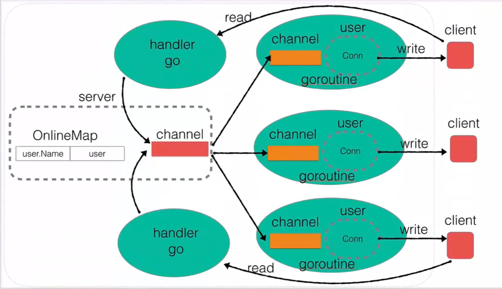

# README



## User

```go
type User struct {
    Name   string
    Addr   string
    C      chan string
    conn   net.Conn
    server *Server
}

func NewUser(conn net.Conn, server *Server) *User {
    userAddr := conn.RemoteAddr().String()

    user := &User{
        Name:   userAddr,
        Addr:   userAddr,
        C:      make(chan string),
        conn:   conn,
        server: server,
    }
    go user.ListenMessage()
    return user
}
func (user *User) ListenMessage() {
    for {
        msg := <-user.C
        user.conn.Write([]byte(msg + "\n"))
    }
}
```

`C`管道用来接受需要发送给客户端的消息，并返回给客户端

## Server

```go
type Server struct {
    Ip        string
    Port      int
    OnlineMap map[string]*User
    maplock   sync.RWMutex
    Message   chan string
}
```

`OnlineMap`保存user_name和user对象的映射关系，通过这个map可以找到对应的user对象进行操作，因为这个对象
可能会被并发访问，所以访问前需要加锁。

`Message`管道用来接受需要广播的消息，

```go
func (this *Server) ListenMessager() {
    for {
        msg := <-this.Message

        this.maplock.Lock()
        for _, client := range this.OnlineMap {
            client.C <- msg
        }
        this.maplock.Unlock()
    }
}
```

```go
        newName := strings.Split(msg, "|")[1]
        _, ok := this.server.OnlineMap[newName]
        if ok {
            this.SendMsg("当前用户名被占用]\n")
        } else {
            this.server.maplock.Lock()
            delete(this.server.OnlineMap, this.Name)
            this.server.OnlineMap[newName] = this
            this.server.maplock.Unlock()
            this.Name = newName
            this.SendMsg(("您已经更新用户名: " + this.Name + "\n"))
        }
```

这里访问时没有加锁，在并发时，可能会导致由于
    并发写入: 如果有多个 goroutine 同时执行这段代码，并且其中一个 goroutine 在另一个 goroutine 执行 OnlineMap[newName] = this 之前对 OnlineMap[newName] 进行了读取，那么这些写入操作可能会相互覆盖，导致数据不一致。

    并发删除: 如果有另一个 goroutine 在执行 delete(this.server.OnlineMap, this.Name) 时，同时另一个 goroutine 执行了 OnlineMap[newName] = this，则可能导致 OnlineMap[newName] 被删除，然后立即又被重新赋值。


## 定时器

```go
func (this *Server) Handler(conn net.Conn) {
    // fmt.Println("connect successfully!")
    user := NewUser(conn, this)
    user.Online()

    isLive := make(chan bool)
    go func() {
        buf := make([]byte, 4096)
        for {
            n, err := conn.Read(buf)
            if n == 0 {
                user.Offline()
                return
            }
            if err != nil && err != io.EOF {
                fmt.Println("Conn Read err: ", err)
            }

            msg := string(buf[:n-1])
            user.DoMessage(msg)

            isLive <- true
        }
    }()

    for {
        select {
        case <-isLive:
            // 什么都不做，为了激活select，更新下面的定时器
        case <-time.After(time.Second * 600):
            user.SendMsg("你被踢了\n")

            close(user.C)
            conn.Close()
            return
        }
    }
}
```

每次客户端发送新的消息，都向isLive管道推入新的值，刷新定时器，否则连接超时踢出用户

## client

```go

func (client *Client) Run() {
    for client.flag != 0 {
        for client.menu() != true {

        }

        switch client.flag {
        case 1:
            // 公聊模式
            fmt.Println("公聊模式选择...")
            client.PublicChat()
            break
        case 2:
            // 私聊模式
            fmt.Println("私聊模式选择...")
            client.PrivateChat()
            break
        case 3:
            fmt.Println("更新用户名模式选择...")
            // 更新用户名
            client.UpdateName()
            break
        }
    }
}
```

客户端程序是一个典型的命令行程序，没有什么特别之处。